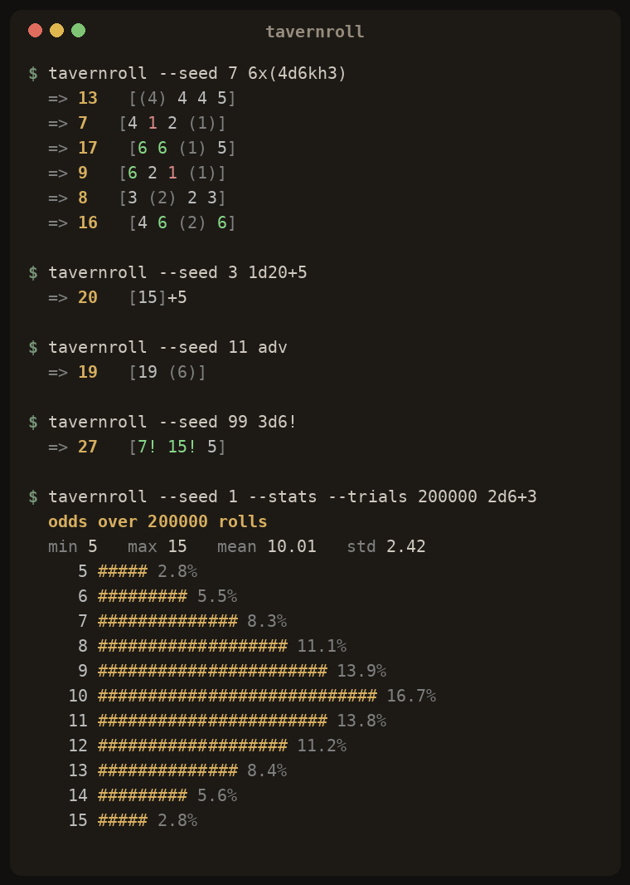

<p align="center">
  
</p>

<h1 align="center">tavernroll</h1>

<p align="center"><em>A fast, fair dice roller for your terminal — built for tabletop nights.</em></p>

<p align="center">
  
</p>

---

## What it is

`tavernroll` is a small command-line dice roller that speaks the notation you
already use at the table. Type `4d6kh3` and it rolls four six-siders and keeps
the best three. Type `adv` and it rolls a d20 with advantage. It reads the dice,
shows every result, colours the crits and the fumbles, and gets out of your way.

No launcher, no account, no network — one tiny C binary that starts instantly
and runs anywhere gcc does.

## Who it's for

Game masters and players who live in a terminal and want dice that are quick to
reach and honest to trust. The engine uses unbiased, rejection-sampled rolls and
a seedable PRNG, so a shared `--seed` reproduces the exact same sequence — handy
for play-by-post games, streamed sessions, or settling "roll it again" disputes.

## Build

```sh
make          # builds ./tavernroll
make test     # runs the unit test suite
```

Requires a C11 compiler and `make`. No third-party dependencies.

## Use

```sh
./tavernroll 2d6+3          # a classic damage roll
./tavernroll 6x(4d6kh3)     # roll a full stat block
./tavernroll adv            # d20 with advantage
./tavernroll "3d6!"         # exploding sixes
./tavernroll --stats 2d6+3  # show the odds before you commit
```

### Notation

| Expression   | Meaning                                             |
|--------------|-----------------------------------------------------|
| `2d6+3`      | roll two d6 and add three                           |
| `d20`        | a single d20 (`1` is implied)                       |
| `4d6kh3`     | keep the highest 3 dice                             |
| `2d20kl1`    | keep the lowest — disadvantage                      |
| `4d6dl1`     | drop the lowest die                                 |
| `3d6!`       | exploding dice — max faces roll again and add       |
| `6x(4d6kh3)` | repeat the whole roll six times                     |
| `adv` `dis`  | shorthand for advantage / disadvantage on a d20     |

### Options

| Flag              | Does                                             |
|-------------------|--------------------------------------------------|
| `-s, --seed N`    | deterministic, reproducible rolls                |
| `-n, --stats`     | print min/max/mean/std plus a probability chart  |
| `--trials N`      | sample size for `--stats` (default 100,000)      |
| `--no-color`      | plain output for logs and pipes                  |
| `-h, --help`      | full help                                         |

Colour turns itself off automatically when the output is piped or when
`NO_COLOR` is set.

## Features

- Full keep/drop notation — `kh`, `kl`, `dh`, `dl` — for stat blocks and (dis)advantage.
- Exploding dice with a safety cap so nothing runs away.
- Repeat rolls in one command (`6x(...)`).
- `--stats` mode with a live probability histogram, so you can weigh the odds.
- Unbiased rolls via rejection sampling and a seedable, cross-platform PRNG.
- Crits, fumbles, and dropped dice are colour-coded at a glance.
- Zero dependencies; a single self-contained binary.

## Licence

MIT — see [LICENSE](LICENSE).
